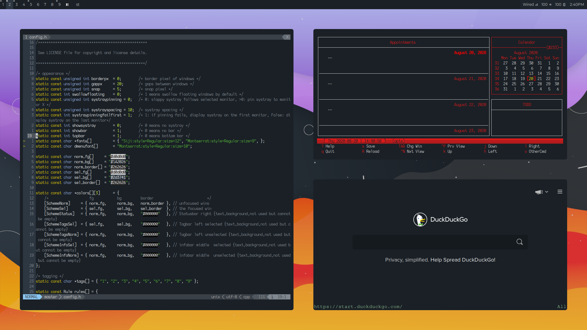

## A collection of the configuration files that I use every day on my machine.

## About
This setup starts from a minimal install of Archlinux and can be implemented fairly easily by installing the programs listed below. My goal with this setup was to make something that was not only aesthetically pleasing but also functional for getting work done. All of the colors and fonts have been chosen specifically with this in mind. You will find screenshots below as well as the wallpaper used.

## Programs
I have attempted to list everything that someone would need for a standard desktop setup. After installing these you can just install software as needed. It is tailored more towards advanced users, but I think that new users could find value from installing any of these fantastic pieces of software.
- [`archlinux`](https://www.archlinux.org/download/) as distribution
- [`dwm`](https://github.com/retinazer/dwm) as window manager (my fork)
- [`st`](https://github.com/retinazer/st) as terminal emulator (my fork)
- [`dmenu`](https://github.com/retinazer/dmenu) as dynamic menu (my fork)
- [`zsh`](https://github.com/zsh-users/zsh) as shell
- [`nnn`](https://github.com/jarun/nnn) as file manager
- [`neovim`](https://github.com/neovim/neovim) as editor
- [`dunst`](https://github.com/dunst-project/dunst) as notification daemon
- [`zathura`](https://github.com/pwmt/zathura) as pdf reader
- [`newsboat`](https://github.com/newsboat/newsboat) as RSS feed reader
- [`picom`](https://github.com/ibhagwan/picom-ibhagwan-git) as compositor (with rounded corners and kawase blur patches)
- [`qutebrowser`](https://github.com/qutebrowser/qutebrowser) as browser
- [`sxiv`](https://github.com/muennich/sxiv) as image viewer
- [`mpv`](https://github.com/mpv-player/mpv) as video player
- [`rtorrent-ps-ch`](https://github.com/chros73/rtorrent-ps-ch) as bittorrent client
- [`irssi`](https://github.com/irssi/irssi) as IRC client
- [`cmus`](https://cmus.github.io/) as music player
- [`pulsemixer`](https://pypi.org/project/pulsemixer/) as pulseaudio controller
- [`scrot`](https://github.com/dreamer/scrot) as screenshot utility
- [`pass`](https://www.passwordstore.org/) as password manager
- [`xwallpaper`](https://github.com/stoeckmann/xwallpaper) as wallpaper utility
- [`calcurse`](https://github.com/lfos/calcurse) as calender application
- [`htop`](https://github.com/hishamhm/htop) as process viewer

<br>

A full list of needed programs are in [`packages.txt`](packages.txt) and can be installed using:
```
# yay -S - < packages.txt
```
Note: I'm using the yay AUR helper on Archlinux. You could use pacman by running:
```
# pacman -S --needed - < packages.txt
```
but you will not have access to any of the AUR packages listed.

<br><br>

## Fonts
All fonts for the configuration are in the ```.local/share/fonts``` directory of the repo.

The main fonts used are:
* `Montserrat` as main font (dwm, dmenu, etc.)
* `Jetbrains Mono` for terminal emulator

<br><br>

## Screenshots
<div align="center">
	
	
</div>

<br>

## Wallpaper (made in GIMP)

